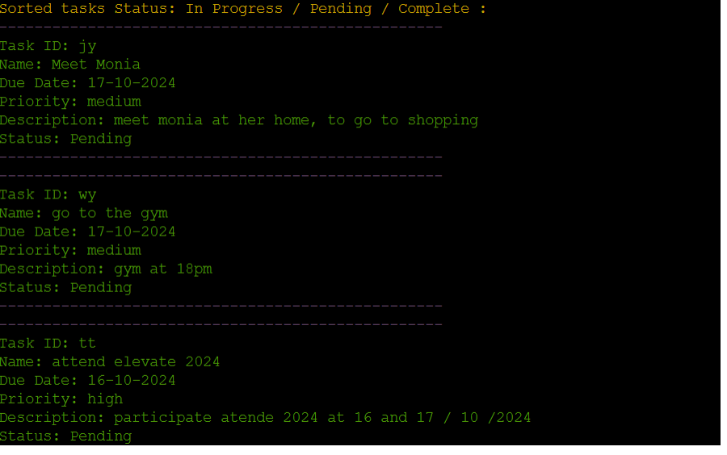

# Task Manager Application

## Table of Contents
- [Purpose of the Project](#purpose-of-the-project)
- [User Stories](#user-stories)
- [Colors](#colors)
- [Technology Used](#technology-used)
    - [Languages](#languages)
    - [Version Control & Deployment](#version-control-&-deployment)
    - [Diagram Tools](#diagram-tools)
    - [Libraries](#libraries)
- [ Flow Chart](#flow-chart)
- [Features](#features)
    - [Welcome page](#welcome-page)
    - [User Registration](#user-registration)
    - [User Login](#user-login)
    - [Menu Task](#menu-task)
    - [Add Task](#add-task)
    - [View All Tasks](#view-all-tasks)
    - [Sort Tasks](#sort-tasks)
    - [Edit Task](#edit-task)
    - [Remove Task](#remove-task)
    - [Logout](#logout)
    - [Google Sheets Structure and Database-Like Relationshi](#google-sheets-structure-and-database-like-relationship)
- [Testing User Stories](#testing-user-stories)
    - [Client Goals](#client-goals)
    - [First Time Visitor Goals](#first-time-visitor-goals)
    - [Returning Visitor Goals](#returning-visitor-goals)
    - [Full Testing](#full-testing)
        - [Landing Page](#landing-page)
        - [Validate Inputs](#validate-inputs)
        - [New User](#new-user)
        - [Existing User](#existing-user)
        - [Main Menu](#main-menu)
        - [Enter Task](#enter-task)
        - [Analyse Tasks](#analyse-tasks)
        - [View Tasks](#view-tasks)
    - [Code Validation](#code-validation)
- [Future Features](#future-features)
- [Bugs Encountered](#bugs-encountered)
- [Deployment](#deployment)
- [Credits](#credits)

## Purpose of the Project
This project is a Task Manager application designed to help users organize, manage, and track their tasks efficiently. It allows users to register, login, and interact with their personal and business tasks through an intuitive menu interface, with options to add, edit, view, sort, and remove tasks. The project integrates with Google Sheets to store user information and task details, ensuring data persistence and accessibility.
[Visit the Live site here](https://task-management1-d329f1a22e0d.herokuapp.com/).

## User Stories
- 1. **User Registration**: As a new user, I want to register an account so that I can start managing my tasks.
- 2. **User Login**: As a returning user, I want to log into my account so that I can access my previously saved tasks.
- 3. **Add Task**: As a user, I want to add new tasks to my task list so that I can keep track of my activities.
- 4. **View Tasks**: As a user, I want to view all my tasks in one place so that I can easily manage my schedule.
- 5. **Edit Task**: As a user, I want to edit the details of a task so that I can update information like due date or priority.
- 6. **Remove Task**: As a user, I want to remove tasks that are no longer needed so that my task list stays organized.
- 7. **Sort Tasks**: As a user, I want to sort my tasks by: name, priority , due date or status, that I can focus on the most important ones.
- 8. **Task Categories**: As a user, I want to categorize my tasks as 'personal' or 'business' so that I can better organize my tasks.

## Colors
Colored text will be shown across the game to make users more interested and attracted. Wrong inputs across the game will be shown in red color, and green color to successuful actions. Colors in the game are imported from Python Colorama Model

## Technology Used

### Languages
- **Python**: 
  - Python serves as the core language for building the application's backend. It manages user authentication, task creation, updating, and integration with external services such as Google Sheets.

### Version Control & Deployment
- **Git**:
  - Git was used for version control, allowing for tracking changes to the project over time. The Visual Studio terminal was used for committing changes, creating branches, and pushing updates to the remote repository.
- **GitHub**:
  - GitHub is the remote repository where the project's code is stored. It allows for collaborative development and serves as a backup of the project's history.
- **Heroku**:
  - Heroku was used for deploying the live project. It allows the application to be accessible online, enabling users to interact with the task manager from any device with internet access.
  
### Diagram Tools
- **Draw.io**:
  - Draw.io was used to create flowcharts that visually represent the workflow of the application, such as user registration, login, and task management processes. This helps in planning the structure of the application and serves as documentation.

### Libraries
- **Flake8**:
  - Flake8 is used for enforcing coding style guidelines (PEP 8) in the Python code. It helps maintain clean, readable, and consistent code by checking for errors, line lengths, and other formatting issues.
- **Art**:
  - Utilized the art library to generate ASCII art for displaying titles and menus in the console, adding a visually appealing element to the application's user interface. For example, the `text2art` function is used to create stylized text for the "Task Manager" and "Task Menu" titles.
- **Google Sheets**:
  - Google Sheets serves as a database for storing user information and tasks. It allows data to be stored in a structured, accessible format that is easily manageable via the Google Sheets API.
- **Google Drive**:
  - Google Drive is used for storing the credentials and allowing access to the Google Sheets that the application interacts with. It provides secure storage for sensitive data required for API authentication.
- **Google Sheets API**:
  - The Google Sheets API allows the application to read from and write to Google Sheets programmatically, enabling the synchronization of user data such as tasks and login information between the app and the Google Sheets.
- **Google Drive API**:
  - The Google Drive API is used to access and manage files stored in Google Drive, which is essential for handling the credentials and providing access to the necessary Google Sheets.
- **gspread Python library**:
  - The `gspread` library is used to simplify the process of interacting with Google Sheets. It abstracts many of the complexities of the Google Sheets API, making it easier to perform operations like reading, writing, and updating data in sheets.
- **google-auth Python library**:
  - `google-auth` is used for handling the authentication process with Google APIs. It allows the application to securely access Google Sheets and Google Drive using service account credentials.
  - **pwinput**:
    - The pwinput library is used to mask password input during the login and registration process, enhancing security by preventing passwords from being visible on the console when entered by the user.

## Flow Chart
The planning of this project was based on the flow charts using the platform Draw.io

View Screenshot

    
    

## Features

### Welcome page

### 1. User Registration
Allows new users to create an account easily within passoword confirmation

### 2. User Login
Existing users can login with their username and password.

### 3. Menu Task
Users after register / login successfully has acess to Task Menu

### 4. Add Task
Users can add new tasks with details such as name, due date, priority, and category.

### 5. View All Tasks
View all tasks in an organized list.

### 6. Sort Tasks
Sort tasks based on different criteria like priority or due date for better viewing.

### 7. Edit Task
Update the details of an existing task.

### 8. Remove Task
Delete a task from the list, and it will be removed from Google Sheets.

### 8. Logout
Logs the user out and returns to the login menu.

### Google Sheets Structure and Database-Like Relationship
- **Overview:**
  - In this project, Google Sheets is used as a simple yet effective way to store and manage data, similar to how a database functions.
  - Each sheet acts like a table in a relational database, with rows representing individual records and columns representing fields of each record.

- **Users Sheet:**
  - The `users` sheet functions similarly to a "Users" table in a database.
  - It stores information about each registered user, including their `username` and encrypted `password`.
  - Each row corresponds to a unique user, and columns like `username` and `password` act as fields that store specific user attributes.
  - This allows for easy user authentication by matching the provided username and password with the stored records.

- **Tasks Sheet:**
  - The `tasks` sheet serves as a "Tasks" table, associating tasks with their respective users.
  - Each row represents a task, including fields for `Task ID`, `username`, `task name`, `due date`, `priority`, `category`, `description`, and `status`.
  - The `username` field acts as a foreign key, linking each task to a specific user from the `users` sheet.
  - This relationship allows users to manage their own tasks independently, as tasks are retrieved and filtered based on the `username` when a user is logged in.

- **Database-Like Relationship:**
  - The connection between `users` and `tasks` in Google Sheets resembles a one-to-many relationship often found in relational databases:
    - **One User to Many Tasks**: Each user (record in the `users` sheet) can have multiple tasks (records in the `tasks` sheet), identified by their `username`.
    - The `username` field in the `tasks` sheet ensures that each task is linked to the appropriate user.
    - This setup allows us to perform operations like adding, updating, or deleting tasks for a specific user while maintaining a clear structure of ownership.

- **Benefits of Using Google Sheets:**
  - Using Google Sheets offers a simple, user-friendly interface for viewing and managing data.
  - It is especially useful for smaller applications that don't require a more complex database setup.
  - Additionally, this approach allows for easy integration with Python scripts through APIs, making it a good choice for projects that benefit from cloud-based data storage without needing a full-fledged database server.
  

## Testing User Stories
### Client Goals
- Provide an intuitive interface for managing tasks.
- Allow users to categorize and prioritize tasks.
- Ensure data persistence for user tasks.

### First Time Visitor Goals
- Easily register and create an account.
- Understand how to add, view, and manage tasks.

### Returning Visitor Goals
- Quickly login and access their tasks.
- Efficiently, view, remove, update and sort tasks.

### Full Testing
All features were manually tested to ensure they work as expected. Below are the specific scenarios tested.
#### Landing Page
- **Test Case 1: Display Options**
  - Verify that the landing page displays options to register and login:
  

View Screenshot

    
    

  #### Validate Inputs
- **Test Case 1: Validate Invalid Inputs**
  - Validate that invalid inputs are handled gracefully and prompt the user to enter a valid choice:
    

View Screenshot Username Validate Inputs

    
    

    

View Screenshot Password Validate Inputs

    
    

#### New User
- **Test Case 1: Successful Registration**
  - Register with a new username and password that meet the length requirements (at least 5 characters).
  - Ensure the user is successfully registered and redirected to the task menu.
  - In all cases, an appropriate error message is displayed to inform the user.

View Screenshot Username Exists

    
    

- **Test Case 2: Username Length Validation**
  - Attempt to register with a username shorter than 5 characters.
  - Verify that an appropriate error message is displayed and the user is prompted to re-enter the username.
  

View Screenshot Username Exists

    
    

- **Test Case 3: Existing Username Conflict**
  - Attempt to register with a username that already exists.
  - Ensure that a message indicating the username already exists is displayed and the user is prompted to choose a different username.
    

View Screenshot Username Exists

    
    

#### Existing User
- **Test Case 1: Successful Login**
  - Login with valid credentials.
  - Ensure the user is successfully authenticated and redirected to the task menu.
    

View Screenshot Login Successfully

    
    

- **Test Case 2: Invalid Username**
  - Attempt to login with a non-existent username.
  - Verify that an appropriate error message is displayed.
    

View Screenshot Invalid Username

    
    

- **Test Case 3: Incorrect Password**
  - Attempt to login with an incorrect password for an existing username.
  - Verify that an appropriate error message is displayed.
    

View Screenshot Incorrect Password

    
    

#### Main Menu
- **Test Case 1: Display Options**
  - Verify that the main menu displays options to add, remove, edit, view, sort tasks, or logout.
  - Validate that invalid inputs are handled gracefully and prompt the user to enter a valid choice.
    

View Screenshot Menu Task Choice

    
    

- **Test Case 2: Logout**
  - Ensure the user is returned to the login screen when selecting the 'Logout' option.
    

View Screenshot Logout

    
    

#### Enter Task
- **Test Case 1: Add Task with Valid Inputs**
  - Add a task with all required fields (name, due date, priority, category, description, status) filled correctly.
  - Ensure the task is successfully added to the appropriate category.
    

View Screenshot Add Task Successfully

    
    

- **Test Case 2: Invalid Task Name**
  - Attempt to add a task with an invalid name (less than 5 characters, can't be only numeric or empty).
  - Verify that an appropriate error message is displayed and the user is prompted to re-enter the task name.
    

View Screenshot Invalid Task Name

    
    

- **Test Case 3: Invalid Due Date Format**
  - Attempt to add a task with an incorrect due date format.
  - Verify that an appropriate error message is displayed and the user is prompted to re-enter the due date.
    

View Screenshot Invalid Due Date

    
    

- **Test Case 4: Invalid Priority**
  - Attempt to add a task with an invalid priority value.
  - Verify that an appropriate error message is displayed and the user is prompted to re-enter the priority.
    

View Screenshot Invalid Priority

    
    

#### Analyse Tasks
- **Test Case 1: Sort by Name**
  - Sort tasks by name and verify that tasks are displayed in alphabetical order.
    - At Task Menu; user can choose to View All Task; and if is more than one task has the option to choose if wants to sort the tasks:
    

View Screenshot Sort Task by name

    
    

- **Test Case 2: Sort by Due Date**
  - Sort tasks by due date and verify that tasks are displayed in chronological order.
  

View Screenshot Sort Task by date

    
    

  
- **Test Case 3: Sort by Priority**
  - Sort tasks by priority and verify that tasks are displayed in the correct order (high, medium, low).
   

View Screenshot Sort Task by priority

    
    

- **Test Case 4: Sort by Status**
  - Sort tasks by status and verify that tasks are displayed in the correct order (In Progress, Pending,  Complete).
  

View Screenshot Sort Task by status

    
    

- **Test Case 5: Sort Tasks Input**
  - Validate input, for error handling to correct user option:
  

View Screenshot Sort Task Validate Input

    
    

#### View Tasks
- **Test Case 1: Display All Tasks**
  - View all tasks and verify that tasks are displayed with all details including name, due date, priority, category, description, and status.
  - Ensure tasks are correctly grouped by category (Personal, Business).
  

View Screenshot Sort Task Validate Input

    
    

- **Test Case 2: No Tasks**
  - Verify that an appropriate message is displayed if there are no tasks to view, same message in the case when no task to: Edit Task or Remove Task

View Screenshot Sort Task Validate Input

    
    

### Code Validation
- **Flake8** validation was utilized to ensure that each `.py` file followed PEP 8 coding standards. This helped maintain clean, consistent, and error-free code throughout the project.
  

View Screenshot Flake8 Validation

  
  

- **Code Institute Python Linter** was used to validate the code on their platform.
  

View Screenshot Linter Validation

  
  

## Future Features
- Implement automated tests using unittest or pytest.
- Extend test coverage to include edge cases and performance testing.
- Integrated Google Calendar API

## Bugs Encountered

- **1. Line Length Violations (E501) with Flake8**:
  - **Issue**: Multiple instances of lines exceeding 79 characters were flagged during code linting with Flake8.
  - **Solution**: Adjusted code formatting and split long strings into multiple lines. Used `black` to auto-format the code but still faced some issues that required manual adjustments.
  - **Lesson Learned**: Auto-formatting tools like `black` help maintain code style, but specific cases may still need manual adjustments.

- **2. Task ID Validation**:
  - **Issue**: During the task update functionality, there were issues with validating whether a given task ID existed in the user's task list.
  - **Solution**: Implemented a search mechanism that iterates through each task in the user's categories (Personal and Business) to verify the existence of the given Task ID before proceeding with updates.
  - **Lesson Learned**: Adding clear validation and error handling ensures a smoother user experience and prevents attempts to update non-existent tasks.

- **3. Google Sheets Data Synchronization**:
  - **Issue**: Inconsistent synchronization between local data and data stored in Google Sheets, leading to outdated task lists for users.
  - **Solution**: Ensured that `save_data_to_sheet()` was called after every significant update to user data, such as adding, editing, or removing a task.
  - **Lesson Learned**: Consistently saving data and testing API interactions helps maintain data integrity between the application and external storage.

- **4. Password Masking with `pwinput`**:
  - **Issue**: Incorrect usage of libraries for password masking; initially used `getpass`, but it didn't provide the desired asterisk masking effect.
  - **Solution**: Switched to the `pwinput` library, which allowed passwords to be masked with asterisks during input.
  - **Lesson Learned**: Researching and testing different libraries can lead to better user experience by meeting specific requirements like password masking.

- **5. Error Handling for Invalid User Input**:
  - **Issue**: Users encountered unhandled exceptions when entering invalid input during login or task updates.
  - **Solution**: Added `try` and `except` blocks around user input sections to provide clear error messages and prevent the application from crashing.
  - **Lesson Learned**: Proactive error handling ensures that users receive informative feedback and the application remains stable even with unexpected inputs.

## Deployment

- **Visual Studio and Git**
  - I created a repository in GitHub for this project and used the Visual Studio terminal for development.
  - Once the repository was created, I cloned it to my local machine using Visual Studio.
  - In the terminal, I used the command `python3 run.py` to run the application during development.
  - At regular intervals, the latest version of the code was saved using the `git add` and `git commit` commands. Appropriate commit messages were added to control the revisions.
  - The `git push` command was used to push all committed code and documentation to the GitHub repository for secure storage.

- **Heroku**
  - This project was deployed using Code Institute's mock terminal for Heroku.
  
  - Steps to deploy:
    1. Log in to Heroku and click "New" then "Create new app".
    2. Name the new app and click "Create new app".
    3. In the "Settings" tab, select "BuildPack" and choose **Python** and **Node.js** (Python must be at the top of the list).
    4. While still in "Settings", click "Reveal Config Vars" and add the following:
       - **KEY**: `PORT`, **VALUE**: `8000`
       - Add content from the `creds.json` file as needed for Google Sheets API access.
    5. Click on the "Deploy" tab and select your deployment method, then search for your repository name.
    6. Click "Connect" on the selected repository.
    7. Choose either "Enable Automatic Deploys" for continuous deployment or "Deploy Branch" for manual deployment.
    8. Heroku will now deploy the app, and it will be accessible from the provided Heroku URL.

## Credits

- **Marko (Tutor)**
  - A special thanks to my tutor, Marko, for all the patience and guidance throughout this project. His consistent support and feedback were invaluable during each phase of the development.

- **Resources for Python and Google Sheets**
  - For beginners looking to understand Python and the integration with Google Sheets, the following resources were particularly helpful:
    - [Automate the Boring Stuff with Python](https://automatetheboringstuff.com/) - A great starting point for Python beginners, providing practical examples and easy-to-follow tutorials.
    - [Google Sheets API Documentation](https://developers.google.com/sheets/api) - A detailed guide for understanding how to interact with Google Sheets using the API.
    - [gspread Documentation](https://gspread.readthedocs.io/en/latest/) - A Python library that simplifies the process of working with Google Sheets.

- **My Husband**
  - I am incredibly grateful to my husband for always being by my side and supporting me through every step of this project. His encouragement and understanding made this journey much smoother.

- **ChatGPT (AI Assistant)**
  - A big thank you to ChatGPT for assisting with understanding complex concepts and helping with the approach to certain parts of the project, including the use of suitable libraries. Its explanations and insights into Python and API integration were crucial for overcoming challenges along the way.
